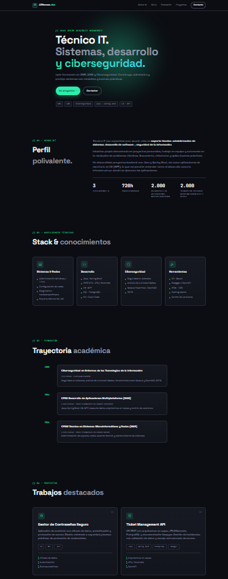
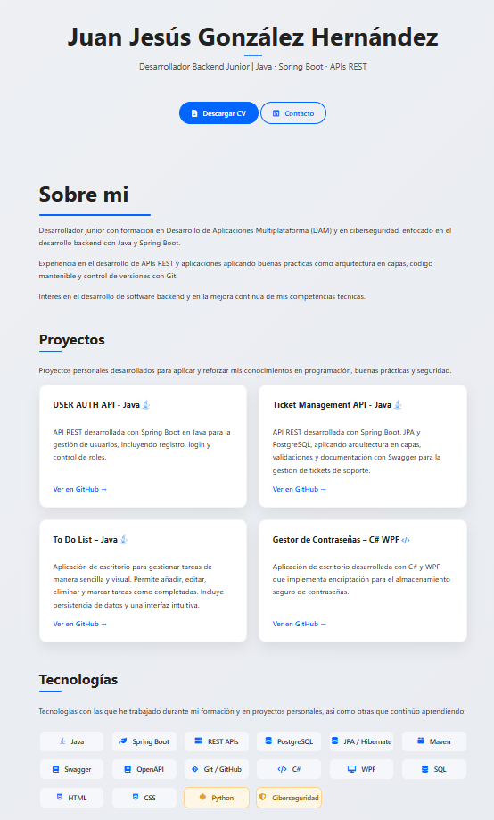

# 🌐 Portfolio - Juan Jesús González Hernández

Portfolio personal creado por Juan Jesús González Hernández

##  Sobre el portfolio

Este repositorio contiene mi portfolio personal desarollado como proyecto web.

El objetivo de crear este portfolio es el de mostrar mi formación académica, mis proyectos personales y mi stack tecnológico de forma clara, moderna y profesional.

##  Enlace al portfolio

https://jjhernan-dev.github.io/

##  Tecnologías usadas

- HTML5
- CSS3
- JavaScript Vanilla
- SVG inline
- Google Fonts

##  Actualizaciones del portfolio

#### Versión v2

Segunda versión del portfolio, más moderno y trabajado.

#### Versión v1

Primera versión del portfolio, simple y muy visual.

Se puede visitar aún desde https://jjhernan-dev.github.io/old

