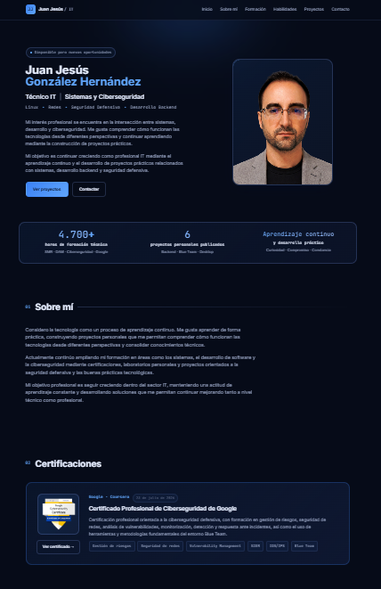
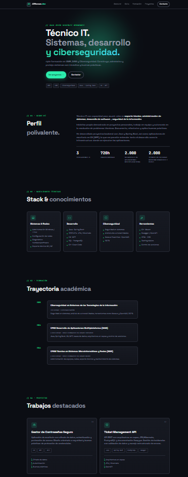
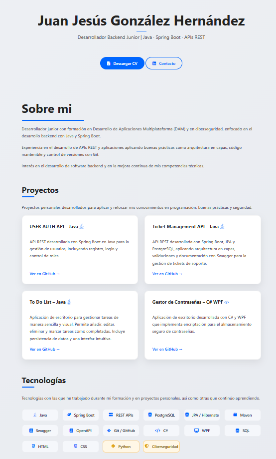

# 🌐 Portfolio - Juan Jesús González Hernández

Portfolio personal creado por Juan Jesús González Hernández

##  Sobre el portfolio

Este repositorio contiene mi portfolio personal desarrollado como proyecto web y concebido como un espacio en constante evolución, donde recopilo mi formación académica, certificaciones y proyectos personales relacionados con el sector IT.

El objetivo del portfolio es presentar de forma clara, moderna y profesional mi trayectoria y las tecnologías con las que trabajo, poniendo especial atención en áreas como los sistemas, el desarrollo de software y la ciberseguridad defensiva.

Más allá de ser una simple página de presentación, este portfolio refleja mi compromiso con el aprendizaje continuo y el desarrollo de proyectos prácticos que me permitan seguir creciendo como profesional IT.

##  Enlace al portfolio

<a href="https://jjhernan-dev.github.io/" target="_blank">jjhernan-dev.github.io</a>

##  Tecnologías usadas

- HTML5
- CSS3
- JavaScript Vanilla
- SVG inline
- Google Fonts

##  Evolución del portfolio

El portfolio ha ido evolucionando con el tiempo conforme he continuado ampliando mi formación, desarrollando nuevos proyectos y definiendo con mayor claridad mi perfil profesional dentro del sector IT.

### Versión 3 (Actual)

Tercera versión del portfolio. Rediseño completo centrado en ofrecer una experiencia más moderna, profesional y coherente con mi trayectoria actual. Incluye una mejor organización del contenido, nuevas secciones dedicadas a formación, certificaciones y proyectos, así como un diseño más cuidado y responsive.

Pueds visitar mi portfolio desde: <a href="https://jjhernan-dev.github.io" target="_blank">https://jjhernan-dev.github.io</a>

### Versión 2

Segunda versión del portfolio, con importantes mejoras visuales respecto a la versión inicial y una estructura más trabajada para la presentación de proyectos y tecnologías.

Todavía puede visitarse desde: <a href="https://jjhernan-dev.github.io/ver/v2" target="_blank">https://jjhernan-dev.github.io/ver/v2</a>

### Versión 1

Primera versión del portfolio. Un diseño más simple y visual que marcó el punto de partida del proyecto.

Todavía puede visitarse desde: <a href="https://jjhernan-dev.github.io/ver/v1" target="_blank">https://jjhernan-dev.github.io/ver/v1</a>

